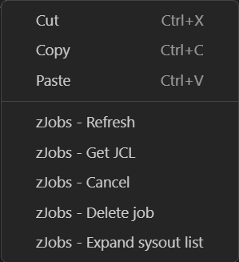

# zjobs README

zJobs is a alternative way to list, view and manage you jobs and sysout files allowing for a more straightforward way to interact with jobs on your mainframe filtered by prefix and/or user.

> To access the extension view right click on you profile in the zowe explorer **Data Sets** or **Jobs treeview**.

## Features

Menu | Function
1. List jobs Filter jobs by prefix and/or userid.
2. Refresh a job information.
3. Open the JCL document retrieved from the job.
4. Cancels a jobs execution.
5. Deletes a job from spool.
6. Opens a list of sysout files derived from the job.
7. Opens a specific sysout file

### Features can be acceded thru the right click menu

Right clicking on a job list item will display the menu.
Right clicking on a spool list item will display a similar menu replacing de *Expand sysout file list* with *Get sysout file* option.

#### Menu

Menu option | Function
---- | ----
Refresh | refreshes a job information.
Get JCL | Open the JCL document retrived from the job.
Cancel | Cancels a jobs execution.
Delete job | Deletes a job from spool.
Expand sysout list | Opens a list of sysout files derived from the job.
Get sysout file | Opens a specific sysout file

> Note: To Expand sysout list or get the sysout file just click on the job/sysout file.

## Requirements

1. VS Code installed.
2. Zowe explorer extension installed.

## Recommendations

1. Ibm Z Open Editor installed.

## Recommendations

1. Ibm Z Open Editor installed.

### 1.0.0

Initial release of zJobs
